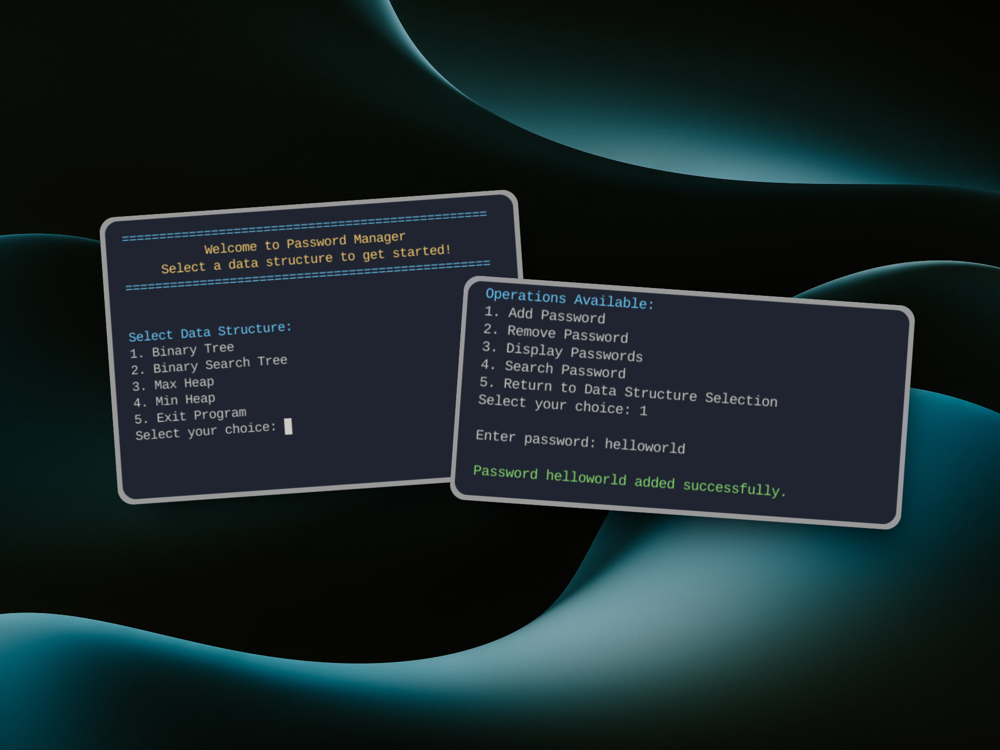

## Table of Contents

1. [Description](#description)
1. [Design](#design)
1. [Features](#features)
1. [Technologies Used](#technologies-used)
1. [Thoughts and Observations](#thoughts-and-observations)
1. [Installation](#installation)

## Description

This project serves as our final project in Data Structures and Algorithm course. As we finished discussing different data structures, the  application of the topics must be implemented to further master it. Password Manager is the chosen project of our group. Through this project we applied tree different data structures, Binary Tree , Binary Search Tree, and Heaps Data structure.

## Design

<div align='center'>

</div>

## Features

1. Add Password

- Input any alphanumeric password
- Automatically converts password to Morse code
- Stores both original password and Morse code in selected data structure
- Example: "PASS123" → ".--. .- ... ... .---- ..--- ...--"

2. Remove Password

- Remove existing password from storage
- For trees: Removes specific password
- For heaps: Removes top element
- Automatically updates data structure after removal

3. Display Passwords

- Shows all stored passwords with their Morse codes
Tree structures offer three viewing options:

- Preorder
- Inorder
- Postorder


- Heaps display in level order

4. Search Password

- Search for specific password
- Shows both password and its Morse code if found
- Returns "not found" message if password doesn't exist

- How to Use

  - Select a data structure (1-4)
  - Choose an operation (1-4)
  - Follow the prompts
  - Return to main menu or exit when done

## Technologies Used

- C++

## Thoughts and Observations

This project had help me and my group-mates understand Tree data structures more clearly. As a leader it had taken me a couple of hours to think about the system we will make. I thought I could create a password encryption using morse code, but the idea was definitely vague, so after analyzing the algorithms and flowchart I've created, I've decided to develop a password-manager instead. Data structures is definitely hard, our main motivation is just try and try again until ideas flow and we can integrate our ideas together to form a system.

## Installation

Make sure you have installed git and c++ compiler in your system.

1. Clone the GitHub repository to your local machine:

   ```bash
   git clone https://github.com/frrst-ian/password-manager.git
   ```

2. Navigate to the project's directory:

   ```bash
   cd password-manager
   ```

3. Open main.cpp file and run the project using your local compiler. 